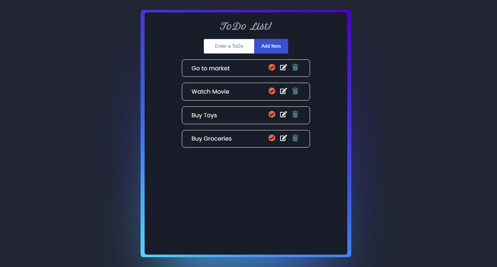

# Getting Started with Create React App

This project was bootstrapped with Create React App

## `npx create-react-app todo`

## `cd todo`

## Available Scripts

In the project directory, you can run:

### `npm start`

Runs the app in the development mode.\
Open [http://localhost:3000](http://localhost:3000) to view it in your browser.

The page will reload when you make changes.\
You may also see any lint errors in the console.

## Deployed App
[inline-style link](https://zingy-begonia-e4a411.netlify.app/ "Todo List App")    

## Demo
https://user-images.githubusercontent.com/61749076/202915111-a462921c-5d4a-4bbf-ae80-3c0e93b721ad.mp4

